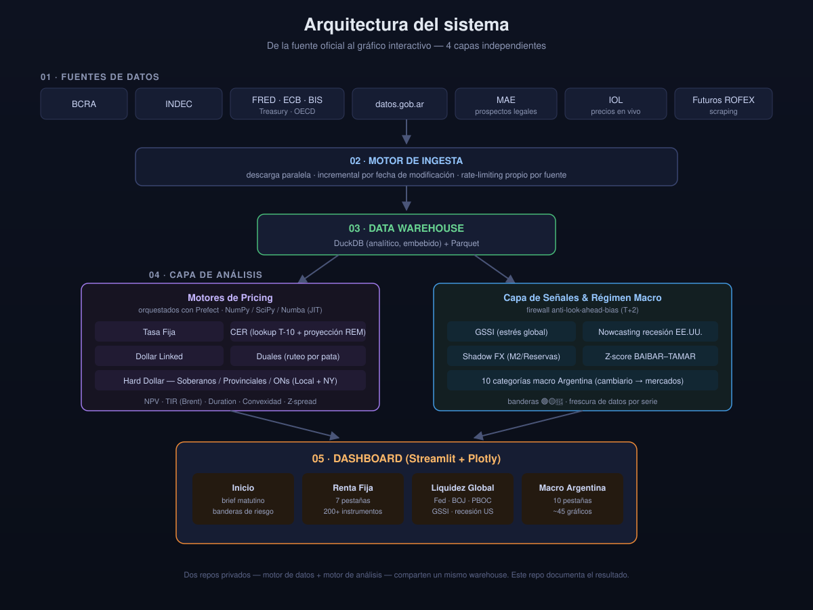

# Terminal de Renta Fija y Macroeconomía Argentina


Escritorio de análisis financiero propio que cubre bonos argentinos (pricing y arbitraje), la economía real de Argentina (actividad, empleo, precios, fiscal, sector externo) y las variables globales que mueve el mercado (tasas americanas, estrés sistémico, curvas de recesión). No es solo un pricer de bonos: es un tablero completo, del tipo que un analista de mesa consulta todos los días para tener la foto completa antes de tomar una posición.

> 📌 **Este repositorio es una vidriera del proyecto.** Documenta su funcionamiento y resultados con capturas reales. El código fuente es privado; este README explica arquitectura, alcance y stack técnico.

**Autor:** Alan Yapaze — [LinkedIn](https://www.linkedin.com/in/alan-yapaze/)
**Vigencia:** 2023 – presente (iniciado como modelado manual en Excel, migrado en 2026 a una arquitectura Python automatizada)

## Índice

- [El proyecto en números](#el-proyecto-en-números)
- [Qué es](#qué-es)
- [Arquitectura](#arquitectura)
- [Cobertura de datos](#cobertura-de-datos)
- [Pipeline de ejecución](#pipeline-de-ejecución)
- [Capturas](#capturas)
- [Qué resuelve](#qué-resuelve)
- [Motores de pricing](#motores-de-pricing)
- [Exportación a Excel: fichas de nivel research desk](#exportación-a-excel-fichas-de-nivel-research-desk)
- [Otros motores destacados](#otros-motores-destacados)
- [Lógica destacada (ejemplo ilustrativo)](#lógica-destacada-ejemplo-ilustrativo)
- [Stack técnico](#stack-técnico)
- [Roadmap](#roadmap)
- [Contacto](#contacto)

## El proyecto en números

| | |
|---|---|
| **13** | fuentes de datos integradas (BCRA, INDEC, FRED, ECB, BIS, Treasury, OECD, datos.gob.ar, UTDT, mercados AR, yfinance, Binance, MAE/IOL) |
| **200+** | instrumentos de renta fija cubiertos (36 soberanos/provinciales + 189 Obligaciones Negociables corporativas + letras y bonos en pesos) |
| **7** | tipos de instrumento con motor de pricing propio |
| **10** | categorías de economía real y mercado cubiertas para Argentina |
| **~330** | funciones de acceso a datos sobre el warehouse (una por serie o grupo de series) |
| **27** | parsers propios para los distintos módulos de Excel oficiales de INDEC |
| **~45** | gráficos interactivos solo en el escritorio de Macro Argentina |
| **25** | tests automatizados: reconciliación de cada ficha Excel contra el precio de mercado y el dashboard en vivo, más paridad verificada entre la tarea programada y la corrida manual |
| **2** | tareas programadas (Windows Task Scheduler) que mantienen datos, precios y pricing frescos sin intervención manual |

## Qué es

Un sistema de dos capas construido para reemplazar el trabajo manual de armar y actualizar planillas de bonos y macro todos los días:

1. **Capa de datos (ETL):** ingesta automatizada desde BCRA, INDEC, FRED/ECB/BIS/Treasury/OECD, datos.gob.ar y prospectos de bonos del MAE, hacia un data warehouse analítico en DuckDB/Parquet.
2. **Capa de análisis y presentación:** motores de pricing y detección de arbitraje propios para renta fija argentina —orquestados con Prefect—, más un escritorio macro (Argentina y global) interactivo en Streamlit.

La lógica financiera y las decisiones de arquitectura son de autoría propia; la implementación de código fue desarrollada con asistencia de agentes de IA (Claude, Gemini) bajo un enfoque de *AI-augmented development* — dirigido por criterio financiero, no por experiencia previa como programador.

## Arquitectura



Dos motores privados —uno de ingesta, uno de análisis— que comparten el mismo warehouse. La descarga de cada fuente corre con su propio manejo de rate-limits y caché incremental (no vuelve a traer lo que no cambió); el pricing y las señales se recalculan sobre esa foto ya consolidada, orquestados como un pipeline de 5 fases con Prefect.

## Cobertura de datos

**Economía real y variables de mercado — Argentina** (10 categorías): Cambiario · Monetario · Actividad · Fiscal · Empleo y Sociedad · Precios · Consumo y Retail · Sector Externo · Expectativas · Mercados.

**Variables globales que mira el mercado**: bancos centrales (Fed, ECB, BOJ, PBOC) y su liquidez agregada · curvas del Tesoro americano y TIPS · inflación breakeven · índice de estrés sistémico (VIX, MOVE, VVIX, CISS) · curvas de recesión (T10Y2Y, T10Y3M) · fiscal de EE.UU.

**Universo de renta fija argentina**: Tasa fija, CER, Dollar Linked, Duales, Soberanos/Provinciales USD y 189 Obligaciones Negociables corporativas (ley local y extranjera), con curva Nelson-Siegel ajustada en vivo para cada clase de emisor.

## Pipeline de ejecución

El sistema corre en un orden fijo de 4 pasos, repartidos entre este repo y su capa de datos (ETL):

1. **Universo de bonos** — sincroniza el universo completo de Títulos Públicos, Obligaciones Negociables y Fideicomisos Financieros del MAE (no solo los "vigentes" que expone la API oficial).
2. **Macro global** — descarga masiva desde BCRA, INDEC, FRED/ECB/Treasury, datos.gob.ar y arma el índice unificado de series. INDEC se gatea contra su propio calendario oficial de difusión (parseado de PDF) — cada módulo se scrapea solo el día que corresponde, con margen de ±1 día por si se publica antes o después.
3. **Precios en vivo** — actualiza intradiario los futuros de dólar (scraping de fuentes públicas de mercado) y los precios de bonos/letras/ON vía IOL, con un contador de cuota mensual que corta antes de arriesgar el acceso a la API.
4. **Motor de pricing y dashboard** — corre el ETL de planillas BCRA/INDEC, dispara el pipeline de pricers (Prefect), exporta el book completo de Excel y levanta el escritorio en Streamlit.

Los pasos 2-4 corren también sin intervención humana vía tareas programadas de Windows — una
diaria para la macro, otra cada 30 minutos en horario de mercado para precios/pricing/export —
con un test automatizado que verifica que la tarea programada corra exactamente el mismo
pipeline que una corrida manual, no una aproximación.

## Capturas

> Todas las capturas son de una corrida real del sistema, sin datos de ejemplo.

### Escritorio Macro Argentina — panel general
Estado de reservas, tasa real, brecha cambiaria, riesgo país, resultado fiscal, actividad y desempleo en un solo panel; reservas del BCRA y riesgo país (EMBI+) con historia completa.


### Cambiario — brecha y evolución de tipos de cambio
"La Trinidad Macro" (inflación mensual, tasa de interés y crawling peg en un mismo eje), brecha CCL/oficial histórica, y evolución completa de los distintos tipos de cambio desde convertibilidad.


### Inflación (IPC) por rubro
Serie histórica completa del IPC (incluye la hiperinflación de 1989-90), apertura por rubro y comparación núcleo vs. estacional vs. regulados — construido sobre el parser propio de los Excel de INDEC.


<!--
📌 4 capturas que le faltan a esta sección para mostrar la cobertura completa de Macro Argentina
   (agregalas donde corresponda, con el mismo formato que las de arriba):

### Inicio — brief matutino
El primer panel que ve el usuario al abrir el sistema: banderas de riesgo (macro global y
riesgo Argentina), cuadro de los 6 tipos de cambio con brecha vs. oficial, y contexto
overnight (futuros de EE.UU., mercados asiáticos, commodities agro).

[PEGAR CAPTURA ACÁ]

### Monetario — agregados y tasas de referencia
M1/M2/M3 y base monetaria, BADLAR/TAMAR, balance del BCRA — el tablero de política monetaria
completo, hoy sin ninguna captura en el repo pese a ser una de las secciones más grandes.

[PEGAR CAPTURA ACÁ]

### Fiscal — resultado y dinámica de financiamiento (rollover)
Resultado primario/financiero del Sector Público Nacional y emisión vs. amortización de
deuda en moneda local y extranjera — el termómetro de cuánta deuda nueva coloca el Tesoro
contra cuánta vence.

[PEGAR CAPTURA ACÁ]

### Consumo y Retail — medios de pago
Evolución de la preferencia del consumidor entre efectivo y tarjetas (débito/crédito) en
supermercados — un gráfico simple y muy legible incluso para un lector no técnico.

[PEGAR CAPTURA ACÁ]
-->

### Tasa Fija y CER — curvas con ajuste Nelson-Siegel
Curvas de rendimiento sobre precios spot para renta fija a tasa fija y ajustada por CER, con la tabla de pricing completa (TIR, TEA, TEM, Duration, Convexidad) detrás de cada punto.


### Dollar Linked — bandas cambiarias y proyección por escenario
Evolución del A3500 contra el régimen oficial de bandas cambiarias, con brecha promedio (6M e histórica) contra el límite superior e inferior; dos escenarios de proyección — devaluación implícita en los futuros A3500 y en los futuros ROFEX — para comparar contra la curva de tasa fija.


### Soberanos y Provinciales USD — MEP implícito y arbitraje legislativo
Ratios de dólar MEP implícito por activo, spread en bps entre pares de bonos soberanos bajo ley local vs. extranjera (AL29/GD29, AL30/GD30, etc.), y curvas por ley (local, extranjera, deuda provincial y Bopreales).


### Corporativos USD — 189 Obligaciones Negociables por ley y por sector
Universo completo de ONs corporativas, segmentadas por ley de emisión (local/extranjera) y por sector económico (agrupa emisores como YPF/PAE/Vista bajo "Oil & Gas", exige un mínimo de 3 tickers para que un sector tenga curva propia).


### Ficha de bono: drill-down completo por instrumento
Click en cualquier ticker de las tablas de pricing de arriba abre una vista de detalle dedicada
para ese instrumento: métricas de sensibilidad completas (TIR, Paridad, Duration, **Vida
Promedio** —distinta de Duration: pesa solo la devolución de capital sin descontar, el número
que de verdad importa en bonos que amortizan en cuotas, no al vencimiento entero—, Convexidad,
DV01 en dos escalas —por 100 de nominal y por una posición real de VN 1.000.000—, spread contra
la curva propia del emisor y concentración del emisor en el universo), detalle completo del
prospecto, cronograma de flujos con Valor Presente de cada flujo (misma estructura que un
modelo de manual de finanzas), gráfico de sensibilidad Precio-vs-TIR con la aproximación
clásica de Duration-Convexidad superpuesta contra el reprecio exacto, comparables por duration
dentro de la misma clase de emisor, otros instrumentos del mismo emisor exacto, y un botón para
exportar la misma ficha, completa, a Excel.

<!--
📌 CAPTURA PENDIENTE (alto valor: es la vista más nueva del sistema, hoy sin ningún ejemplo
   visual en este README). Sugerencia concreta: entrá a Soberanos USD, click en un ticker
   como AO27 o GD30 — esa clase de instrumento arma el prospecto más completo (incluye el
   link al documento legal). Capturá:
   1. La parte de arriba: KPIs + Detalle del Prospecto (hasta donde arranca el cronograma).
   2. Scrolleada más abajo: cronograma de flujos + el gráfico de sensibilidad
      Precio-vs-TIR con las dos curvas (exacta y aproximación Duration-Convexidad).
   Pegá cada una donde corresponda, con el mismo formato  que las de arriba.
-->

### Tablero de Arbitraje: señales cuantitativas de trading
Dos motores de detección de desfasajes de precio, con acción sugerida (comprar/vender) calculada en vivo:

- **Inflación implícita vs. mercado (BEI vs. REM):** empareja una Lecap y un bono CER que vencen el mismo día para extraer la inflación que el mercado está pricing (BEI) y la compara contra el consenso de analistas (REM). Si el bono CER rinde tan poco que asume una inflación irrealmente alta, señala vender ese CER y pasarse a la Lecap (LONG FIJA).
- **Arbitraje FX sintético (Dollar Linked vs. Tasa Fija):** simula el rendimiento de un bono Dollar Linked asumiendo que el dólar devalúa según lo que pricean los futuros de dólar (obtenidos por scraping), y lo compara contra una Lecap del mismo plazo — si la devaluación implícita en el Dollar Linked es menor a la que rendiría la tasa fija, señala vender el Dollar Linked y pasarse a tasa fija.


### Semáforo de estrés sistémico global (GSSI) y tasas americanas
Índice compuesto de estrés de mercado (percentiles históricos de VIX, MOVE, VVIX, CISS), curva del Tesoro americano, TIPS, inflación breakeven, y las dos curvas que la propia Fed de Nueva York usa como modelo oficial de probabilidad de recesión (T10Y2Y y T10Y3M), con historia desde fines de los '70.


## Qué resuelve

Antes de este sistema, armar la foto diaria del mercado de renta fija argentino significaba actualizar planillas de Excel a mano: bajar precios, recalcular TIR y duration bono por bono, y cruzar manualmente con la macro del día. Este sistema automatiza esa cadena completa y agrega capacidades que no existían en la versión manual: ajuste de curvas por Nelson-Siegel, detección de arbitraje legislativo y de arbitraje FX sintético con acción sugerida, y un panel de riesgo sistémico global actualizado en vivo — todo cruzado contra el contexto macro real de Argentina y del mundo, no solo el precio del bono en el vacío.

## Motores de pricing

Cobertura de 7 tipos de instrumentos de renta fija argentina, sobre un universo de más de 200 activos (36 soberanos/provinciales + 189 Obligaciones Negociables corporativas + Letras y bonos en pesos):

- Tasa fija (soberana, provincial, corporativa)
- CER (ajustados por inflación — lookup a T-10 sobre CER Base y CER de liquidación/vencimiento, más un proyector propio que extiende la curva a futuro con el REM cuando aún no hay CER oficial publicado)
- Dollar-linked
- Duales (con ruteo automático por pata ganadora)
- Hard dollar (soberanos y corporativos en USD, ley local y extranjera)

Cálculos incluidos: NPV, Duration Macaulay/Modificada, Convexidad, Z-spread contra la curva del Tesoro americano interpolada, y solvers de TIR propios — un **solver por método de Brent optimizado con Numba (JIT)** para los instrumentos en pesos (tasa fija, CER, duales), y `scipy.optimize.brentq` para los bonos hard-dollar.

## Exportación a Excel: fichas de nivel research desk

Cada instrumento se puede exportar a un Excel completo con la misma metodología y los mismos
números que el dashboard en vivo — nunca una fórmula paralela: reusa el motor de pricing, con
un flag que además le hace devolver el cronograma detallado fila por fila.

- **Cronograma completo con Valor Presente de cada flujo** (PVCF), con una fila de control que
  reconcilia la suma de los PVCF contra el precio efectivamente pagado — la misma estructura
  que arma un analista a mano en un modelo de manual de finanzas.
- **Cronograma en pesos NOMINALES, no en unidades de valor nominal (VN) constantes**: para
  instrumentos CER, cada cupón/amortización futuro se multiplica por el coeficiente CER
  proyectado a ESA fecha puntual (no un único coeficiente fijo de hoy), así un cupón
  contractualmente parejo se ve crecer en $ a medida que se aleja en el tiempo; para Dollar
  Linked, cada flujo se muestra en USD y en ARS al tipo de cambio proyectado de ese día bajo
  cada uno de los 4 escenarios. La TIR/Duration/Convexidad y el análisis de sensibilidad se
  siguen resolviendo en términos reales — separar ambas vistas evita el error clásico de leer
  "100" en una fila de un bono indexado y pensar que ese es el dinero real que se cobra.
- **Análisis de sensibilidad**: tabla y gráfico de Precio vs. TIR en un rango de ±10 puntos
  porcentuales, con la aproximación clásica de Duration-Convexidad superpuesta contra el
  reprecio exacto — muestra en qué rango de movimiento de tasa la aproximación lineal de manual
  sigue siendo confiable y dónde empieza a divergir del valor real.
- **DV01** en dos escalas (por 100 de nominal y por una posición real de VN 1.000.000), **Vida
  Promedio** (average life, distinta de Duration), **spread contra la curva propia** del
  emisor, y **comparables** — los bonos de duration más parecida dentro de la misma clase de
  emisor, más una tabla aparte con otros instrumentos del mismo emisor exacto (primer chequeo
  de concentración de un analista de riesgo).
- **Detalle completo del prospecto**: emisor, ISIN, ley, tipo de amortización, frecuencia de
  pago, base de cálculo, y las fechas de referencia exactas usadas para tasas variables
  (TAMAR/BADLAR) o ajuste por CER (CER Base/Liquidación a T-10, coeficiente aplicado).
- **Exportación masiva**: un botón arma un .zip con una ficha por cada instrumento vigente del
  universo completo, organizadas en carpetas por tipo y emisor, más un archivo "Global" por
  clase de instrumento con una hoja Resumen — hipervínculos a la hoja de cada ticker y escala
  de color condicional incluidos — para tener el book completo de renta fija en un solo click.

Validado con 21 tests (pytest) que reconcilian, para todo el universo vigente, el PVCF
exportado contra el precio de mercado y contra el valor que muestra el dashboard en vivo —
ninguna de las dos vistas puede divergir de la otra sin que un test lo detecte.

<!--
📌 CAPTURA(S) PENDIENTE(S) (alto valor: esta sección entera hoy es solo texto, sin ninguna
   prueba visual — es probablemente el hueco más grande del README). Abrí cualquier .xlsx
   exportado en Excel y capturá:
   1. La hoja de un ticker: bloque de KPIs + Detalle del Prospecto + el arranque del
      cronograma con las columnas PVCF/t×PVCF visibles — muestra de un vistazo que no es un
      Excel genérico, es una planilla de manual de finanzas con trazabilidad completa.
      Si entra en el mismo screenshot, mejor: la tabla de sensibilidad ±10pp al costado con
      su gráfico embebido (Precio vs. TIR, exacta vs. aproximación Duration-Convexidad).
   2. (Opcional pero potente) La hoja "Resumen" de un archivo `<Clase>_Global.xlsx` de la
      exportación masiva: la escala de color condicional en TIR/Paridad y los hipervínculos
      a cada ticker se ven de un vistazo, y comunican "esto está pensado como herramienta de
      trabajo real", no solo como demo.
-->

## Otros motores destacados

- **Calculadora de FX implícito (MEP/CCL)**: prioriza fuente de precio (API de bróker → ratio AL30/GD30 → A3500) y descarta automáticamente cotizaciones con más de 30 días de antigüedad.
- **Motor de régimen macro**: construye una matriz diaria de régimen con un *firewall* anti-look-ahead-bias (retrasa 2 días las variables del BCRA para simular el rezago real de publicación), más un "Shadow FX" (tipo de cambio implícito por M2/reservas) y un Z-score móvil (ventana de 90 días) del spread interbancario BAIBAR-TAMAR.
- **Semáforo de Estrés Sistémico Global (GSSI)**: índice compuesto 0-100 por percentil histórico de VIX, MOVE, VVIX y CISS, con su variación mensual como referencia de tendencia.
- **Proyector de CER por REM**: cuando el BCRA todavía no publicó el CER oficial de una fecha futura, bootstrapea la curva de inflación mensual implícita en el REM (Relevamiento de Expectativas de Mercado) y la proyecta día a día, respetando qué mes de IPC corresponde legalmente aplicar según el día del mes.
- **Scraping de INDEC gateado por su propio calendario oficial**: en vez de scrapear los 26 módulos activos todos los días, el sistema parsea el PDF de calendario de difusión semestral de INDEC (layout de 2 columnas, reconstruido por posición de palabra) y solo va a buscar cada módulo el día que le corresponde según ese calendario — con margen de tolerancia y un modo *fail-open* que nunca deja de scrapear algo por un mapeo incompleto.
- **Deuda Externa Bruta, recuperada de su fuente real vigente**: el reporte standalone de Deuda Externa de INDEC está discontinuado desde 2017 (verificado navegando la página oficial en vivo); la serie completa 2006-hoy sigue publicándose, pero integrada dentro del informe combinado de Cuentas Internacionales — el parser se extendió para extraerla de ahí, en vez de asumir que "no hay dato" por seguir apuntando a la página vieja.
- **Unificación de fuentes oficiales por sobre agregadores de terceros**: antes de migrar una serie (inflación, tasa de depósitos) de un agregador externo a la API oficial del BCRA, se verifica en vivo que ambas fuentes den exactamente el mismo historial — la migración se hace solo cuando la oficial es al menos igual de completa (y, en algún caso, más actualizada), nunca a ciegas por preferencia.
- **Gestión de cuota de API con circuit-breaker**: el consumo mensual de la API de precios de mercado se trackea en una base local; si se acerca al límite del plan gratuito, el sistema corta las llamadas antes de arriesgar un bloqueo, en vez de descubrirlo a mitad de mes con el servicio caído.

## Lógica destacada (ejemplo ilustrativo)

El código real es privado — esto es una versión simplificada, escrita para este README, que ilustra el criterio detrás de una de las señales del Tablero de Arbitraje (no es el código productivo):

```python
# Arbitraje FX sintético: Dollar Linked vs. Tasa Fija (ejemplo conceptual)
devaluacion_implicita_dl = tasa_futuro_dolar(plazo) - 1          # lo que pricea el mercado de futuros
rendimiento_tasa_fija = tir_lecap(mismo_plazo)                    # tasa fija comparable, mismo plazo

if devaluacion_implicita_dl < rendimiento_tasa_fija:
    señal = "VENDER Dollar Linked -> COMPRAR Tasa Fija"
    # el mercado de futuros está pricing menos devaluación de la que rinde
    # quedarse en pesos a tasa fija -> el Dollar Linked está "caro" en términos relativos
else:
    señal = "Sin arbitraje: la devaluación implícita ya compensa el diferencial de tasa"
```

## Stack técnico

| Capa | Tecnologías |
|---|---|
| Orquestación del pipeline de pricing | Prefect (5 fases: limpieza, ingesta a warehouse, pricing tasa fija/CER, pricing macro/FX, bonos duales, hard dollar) |
| Motor de ingesta multi-fuente | Descarga paralela propia, con caché incremental y rate-limiting por API |
| Almacenamiento analítico | DuckDB, Parquet |
| Cálculo numérico | NumPy, SciPy, Numba (JIT) |
| Fuentes de datos | API BCRA, INDEC (parsers de Excel oficiales), FRED, ECB, BIS, Treasury, OECD, datos.gob.ar, prospectos MAE (PDF), precios IOL, futuros de dólar (scraping) |
| Extracción de fichas de bonos | PyMuPDF (texto) + parsing automático por expresiones regulares del documento legal definitivo; lectura asistida por LLM en el flujo de carga manual de casos no estándar |
| Generación de reportes | openpyxl (fichas Excel completas por instrumento, exportación masiva del universo) |
| Dashboard | Streamlit, Plotly |
| Validación | pytest (25 tests: reconciliación PVCF↔precio del exportador Excel, consistencia contra el warehouse, paridad automatizada entre la tarea programada y la corrida manual) |
| Automatización | Windows Task Scheduler (2 tareas: macro diaria, precios/pricing/export cada 30 min en horario de mercado) con control de cuota de API |

## Roadmap

- **Portfolio tracking y optimización por duration target**: ya prototipado (carga de posiciones propias + optimizador de cartera con restricciones — TIR mínima, concentración máxima por activo, duration objetivo); en revisión antes de reintegrarlo al dashboard en vivo.
- **Reservas internacionales NETAS** (brutas − encajes en USD − swaps): hoy el panel muestra solo el proxy bruto por falta de una fuente pública confiable de encajes/swaps.

## Contacto

¿Preguntas sobre el proyecto o interés en el desarrollo? [Alan Yapaze en LinkedIn](https://www.linkedin.com/in/alan-yapaze/)
