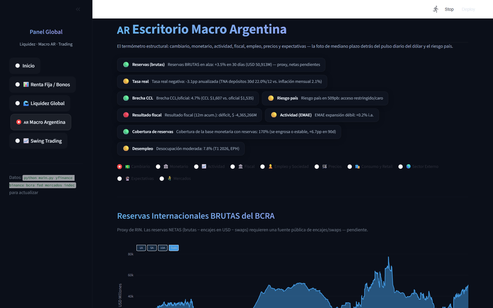
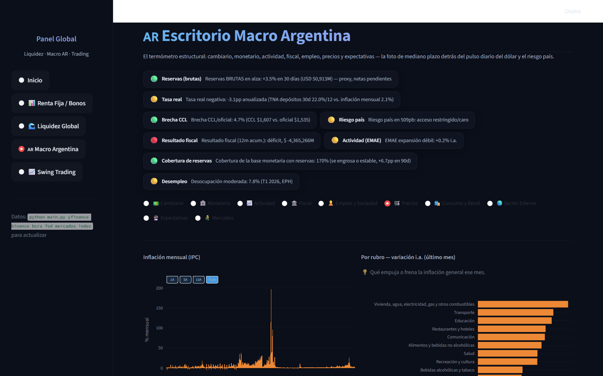
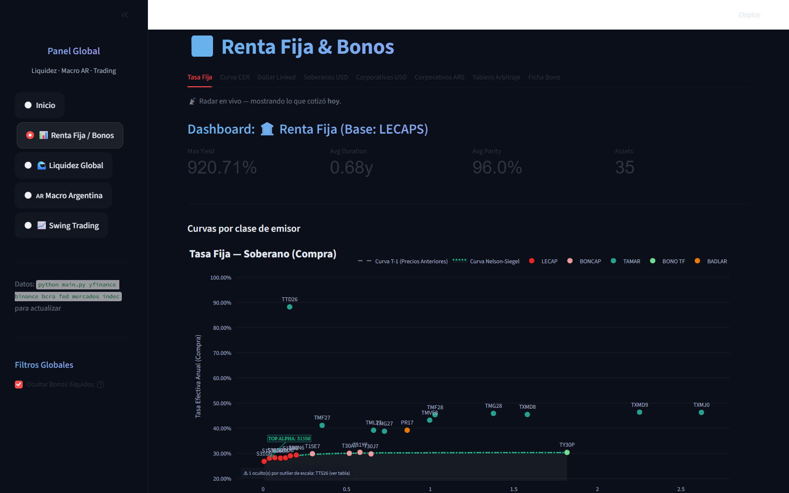
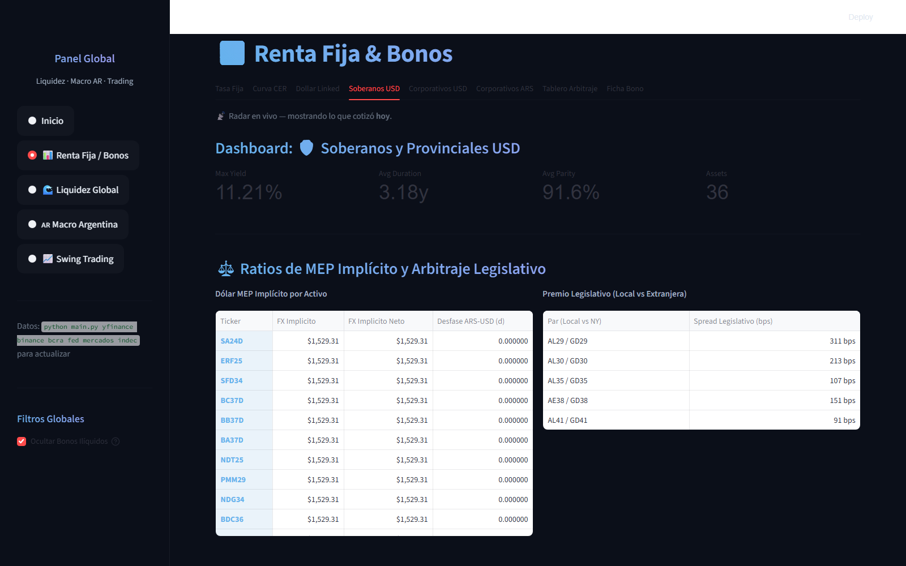
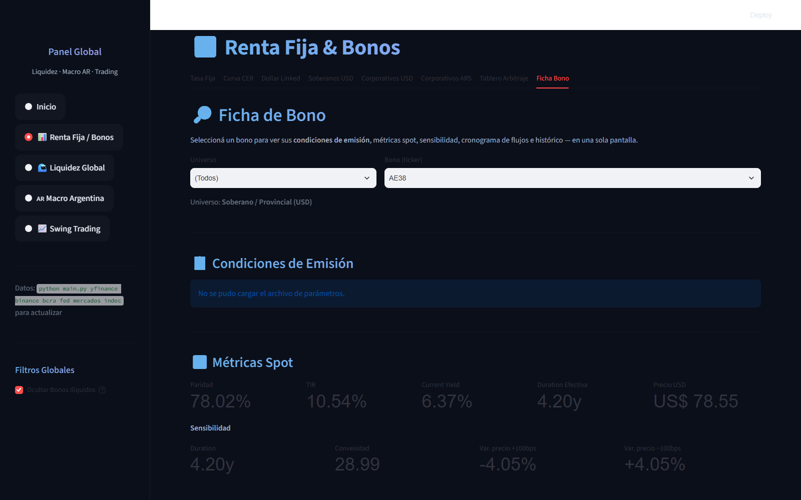
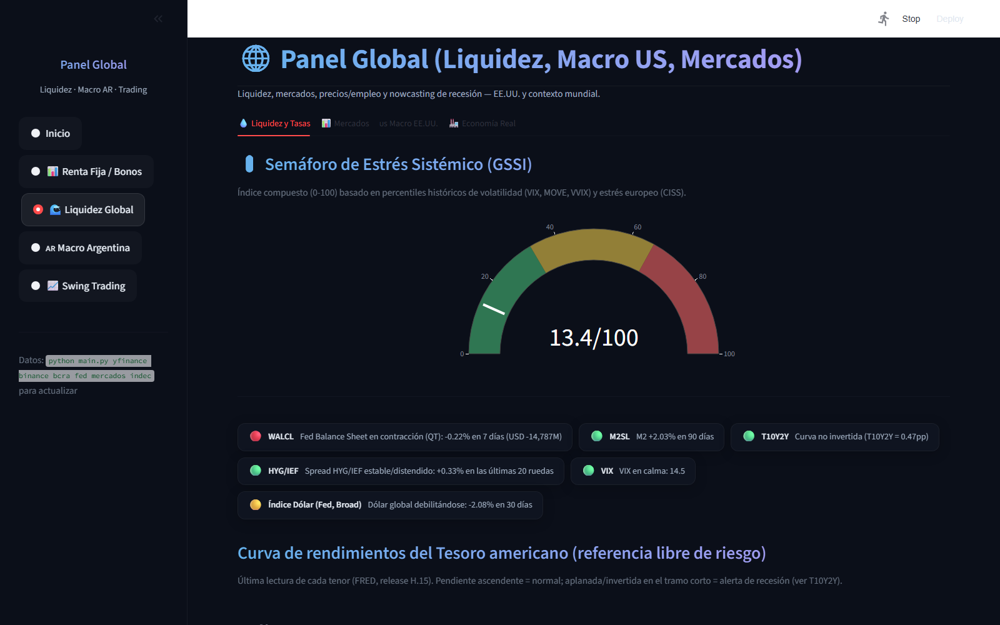

# Terminal de Renta Fija y Macroeconomía Argentina

Sistema propio de análisis cuantitativo para el universo de deuda soberana, provincial y corporativa argentina, con un escritorio macro que cruza variables locales (BCRA, INDEC) y globales (FRED).

> 📌 **Este repositorio es una vidriera del proyecto.** Documenta su funcionamiento y resultados con capturas reales. El código fuente es privado; este README explica arquitectura, alcance y stack técnico.

**Autor:** Alan Yapaze — [LinkedIn](https://www.linkedin.com/in/alan-yapaze/)
**Vigencia:** 2023 – presente (iniciado como modelado manual en Excel, migrado en 2026 a una arquitectura Python automatizada)

---

## Qué es

Un sistema de dos capas construido para reemplazar el trabajo manual de armar y actualizar planillas de bonos y macro todos los días:

1. **Capa de datos (ETL):** ingesta automatizada desde BCRA, INDEC, FRED, datos.gob.ar y prospectos de bonos del MAE, orquestada con Prefect, hacia un data warehouse analítico en DuckDB/Parquet.
2. **Capa de análisis y presentación:** motores de pricing propios para renta fija argentina y un dashboard interactivo en Streamlit para explorar el resultado.

La lógica financiera y las decisiones de arquitectura son de autoría propia; la implementación de código fue desarrollada con asistencia de agentes de IA (Claude, Gemini) bajo un enfoque de *AI-augmented development* — dirigido por criterio financiero, no por experiencia previa como programador.

## Capturas

### Escritorio Macro Argentina
Estado de reservas, tasa real, brecha cambiaria, riesgo país, resultado fiscal, actividad y desempleo en un solo panel, con series históricas del BCRA.

### Inflación (IPC) por rubro
Serie histórica completa del IPC, apertura por rubro y comparación núcleo vs. estacional vs. regulados — construido sobre el parser propio de los Excel de INDEC.

### Curvas de Renta Fija con ajuste Nelson-Siegel
Curva de tasa fija soberana con el ajuste de la curva Nelson-Siegel superpuesto sobre los precios de mercado del día.

### Arbitraje legislativo (Ley Local vs. Ley Extranjera)
Ratios de dólar MEP implícito por activo y spread en bps entre pares de bonos soberanos bajo legislación local vs. extranjera (AL29/GD29, AL30/GD30, etc.).

### Ficha de bono: sensibilidad y duration
Métricas spot (paridad, TIR, current yield) y de sensibilidad (Duration, Convexidad, variación de precio ante ±100bps) calculadas para cada bono del universo.

### Semáforo de estrés sistémico global (GSSI) y tasas americanas
Índice compuesto de estrés de mercado (percentiles históricos de VIX, MOVE, VVIX, CISS) junto a la curva del Tesoro americano, TIPS e inflación breakeven.

## Qué resuelve

Antes de este sistema, armar la foto diaria del mercado de renta fija argentino significaba actualizar planillas de Excel a mano: bajar precios, recalcular TIR y duration bono por bono, y cruzar manualmente con la macro del día. Este sistema automatiza esa cadena completa y agrega capacidades que no existían en la versión manual: ajuste de curvas por Nelson-Siegel, detección de arbitraje legislativo, y un panel de riesgo sistémico global actualizado en vivo.

## Motores de pricing

Cobertura de 7 tipos de instrumentos de renta fija argentina:

- Tasa fija (soberana, provincial, corporativa)
- CER (ajustados por inflación)
- Dollar-linked
- Duales (con ruteo automático por pata ganadora)
- Hard dollar (soberanos y corporativos en USD, ley local y extranjera)

Cálculos incluidos: NPV, Duration Macaulay/Modificada, Convexidad, y un **solver de TIR propio por método de Brent** (híbrido bisección / interpolación cuadrática inversa), optimizado con Numba (JIT) para performance.

## Stack técnico

| Capa | Tecnologías |
|---|---|
| Orquestación ETL | Prefect |
| Almacenamiento analítico | DuckDB, Parquet |
| Cálculo numérico | NumPy, SciPy, Numba (JIT) |
| Fuentes de datos | API BCRA, INDEC (parsers de Excel oficiales), FRED, datos.gob.ar, prospectos MAE (PDF) |
| Extracción de fichas de bonos | PyMuPDF + LLM para estructurar parámetros de prospectos |
| Generación de reportes | fpdf2 (fichas técnicas en PDF) |
| Dashboard | Streamlit, Plotly |
| Validación | pytest |

## Contacto

¿Preguntas sobre el proyecto o interés en el desarrollo? [Alan Yapaze en LinkedIn](https://www.linkedin.com/in/alan-yapaze/)
